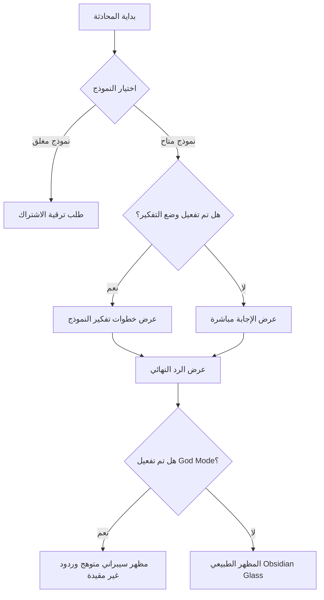

# 📄 وثيقة متطلبات المنتج (PRD) - ApexChat
**AI Chat SaaS powered by Cerebras Cloud & Firebase**

---

## 📅 تفاصيل المستند (Document Control)
* **اسم المنتج:** ApexChat (منصة المحادثة الذكية المتطورة)
* **الحالة:** جاهز للإنتاج (Gold Master)
* **المطور/المعد:** Antigravity AI
* **تاريخ آخر تحديث:** 2026-07-03

---

## 1. الملخص التنفيذي والرؤية (Executive Summary & Vision)
تطبيق **ApexChat** هو منصة محادثة ذكية متطورة قائمة على الويب كنموذج برمجيات كخدمة (SaaS). يهدف التطبيق إلى تقديم تجربة محادثة فائقة السرعة بالاستفادة من خوادم **Cerebras Cloud API**، مع دمج نظام اشتراكات مدفوع مقسم إلى فئات (Tier-Based Subscription) عبر قسائم شحن (Vouchers)، وميزات حصرية متطورة تعتمد على الفئة مثل "وضع التفكير" و"البحث العميق" وتصميم "وضع الإله" (GOD MODE) المستوحى من الطابع السيبراني.

> [!NOTE]
> يتبنى التطبيق فلسفة تصميم **The Obsidian Glass** (الزجاج البركاني الأسود)، وهي واجهة معتمة بريميوم تعتمد على الشفافية (Glassmorphism)، الحدود الدقيقة (Micro-borders)، والحركات مرنة وتفاعلية (Framer Motion) لتقديم تجربة بصرية مبهرة وفائقة الفخامة.

---

## 2. الجمهور المستهدف وسيناريوهات الاستخدام (Target Audience & Scenarios)
1. **المطورون والمحترفون:** الباحثون عن استجابة فورية فائقة السرعة لتوفير الوقت أثناء البرمجة وحل المشاكل.
2. **الباحثون والمحللون:** المستخدمون الذين يحتاجون لأدوات بحث متقدمة كـ (Deep Research) لتحليل موضوعات معقدة واستخراج تقارير متكاملة.
3. **عشاق الطابع السيبراني (Cyberpunk Enthusiasts):** المستخدمون النخبة الراغبون في تجربة ذكاء اصطناعي غير مقيدة بمظهر وتصميم تقني متوهج فريد (GOD MODE).

---

## 3. الهيكل التنظيمي للميزات (Features & Functional Requirements)

### 3.1 نظام إدارة المستخدمين والمصادقة (User Auth & Profile)
* **تسجيل الدخول والتسجيل:**
  * دعم تسجيل الدخول التقليدي عبر البريد الإلكتروني وكلمة المرور.
  * دعم تسجيل الدخول السريع بضغطة زر عبر **Google OAuth**.
  * خيار استعادة كلمة المرور وإرسال بريد إلكتروني لإعادة التعيين.
* **حماية المسارات (Protected Routes):**
  * جميع المسارات داخل التطبيق (المحادثة، الإعدادات، الفواتير، الاشتراك) محمية ومغلقة للمستخدمين غير المسجلين.
  * إعادة توجيه المستخدم غير المصادق عليه تلقائيًا إلى `/login` مع شاشة تحميل سلسة تمنع وميض الصفحة.
* **إدارة الملف الشخصي:**
  * صفحة مخصصة للإعدادات تتيح للمستخدم تحديث (الاسم المعروض Display Name) ورابط (الصورة الرمزية Avatar URL).
  * مزامنة البيانات بشكل لحظي مع قاعدة بيانات **Firebase Firestore**.

---

### 3.2 واجهة المحادثة والذكاء الاصطناعي (AI Chat Experience)
* **محدد النماذج الذكي (Model Selector):**
  * قائمة منسدلة ديناميكية لاختيار النموذج المطلوب للتحدث معه.
  * قفل النماذج غير المتوفرة لفئة اشتراك المستخدم الحالي بشكل مرئي مع عرض زر الترقية.
* **أوضاع التشغيل المتقدمة (Advanced Chat Modes):**
  * **وضع التفكير (Thinking Mode):** يعرض للمستخدم خطوات تفكير النموذج وتحليله للمشكلة خطوة بخطوة قبل إظهار الرد النهائي.
  * **البحث العميق (Deep Research Mode):** متاح لمشتركي الفئات المتقدمة، ويقوم بإجراء عمليات بحث وتحليل معمق وشامل للمواضيع.
  * **وضع الإله (GOD MODE):** حصري لفئة النخبة (Apex Elite)، ويقوم بتعديل الواجهة بالكامل بأسلوب سيبراني متوهج باللون الأخضر وخلفية مصفوفة متحركة (Matrix Drop Background)، مع إرسال موجهات نظام (System Prompts) غير مقيدة للحصول على إجابات تفاعلية متحررة.



---

### 3.3 نظام الفئات والتحقق من الاشتراكات (Subscription Tiers & Vouchers)

التطبيق مقسم إلى 3 فئات اشتراك رئيسية:

| الفئة (Tier) | السعر الشهري | النماذج المدعومة (Supported Models) | الميزات الإضافية (Extra Features) | كود القسيمة للتجربة |
| :--- | :--- | :--- | :--- | :--- |
| **Starter (المبتدئ)** | $20 / mo | Llama 3.1 8B, Qwen 3 32B | المحادثة الأساسية فائقة السرعة | `STARTER_2025` |
| **Pro (المحترف)** | $50 / mo | + Llama 3.3 70B, GPT OSS 120B | وضع البحث العميق (Deep Research) | `DEEP_PRO_X` |
| **Apex Elite (النخبة)** | $100 / mo | + Qwen 3 235B, ZAI GLM 4.6 | وضع الإله (GOD MODE) + كافة الميزات | `CHAOS_THEORY_100` |

* **نظام القسائم (Vouchers):**
  * إدخال كود القسيمة في صفحة الاشتراكات أو الفواتير.
  * التحقق من الكود وتحديث رصيد المستخدم ومستوى اشتراكه فورياً في قاعدة بيانات Firestore.
  * تحديث واجهة المستخدم وصلاحيات الموديلات فوراً بدون الحاجة لإعادة تحميل الصفحة.

---

### 3.4 المحفظة وسجل الفواتير (Wallet & Billing History)
* **المحفظة (Wallet Dashboard):**
  * عرض الرصيد الحالي للمستخدم في محفظته بالتطبيق بالدولار.
  * عرض بطاقة الاشتراك الحالية وتاريخ تفعيلها وفترة الصلاحية.
* **سجل المعاملات (Billing History):**
  * جدول يعرض القسائم المفعلة سابقاً.
  * تشمل البيانات: تاريخ العملية، الكود المستخدم، القيمة المالية التي تمت إضافتها، والفئة المفعلة.

---

## 4. المواصفات التصميمية والتجربة البصرية (UI/UX Specifications)

### 4.1 نمط التصميم: الزجاج البركاني (The Obsidian Glass)
* **الخلفية الأساسية:** اللون الأسود المطلق `#0a0a0a` (The Void).
* **البطاقات والقوائم:** خلفية زنك داكنة شفافة مع تأثير ضبابي للخلفية (`bg-zinc-900/80 backdrop-blur-xl`).
* **الحدود الدقيقة:** حدود دائرية رفيعة بنسبة شفافة خفيفة (`border border-white/10`).
* **الخطوط:** استخدام خطوط عصرية وواضحة (مثل Outfit أو Inter من Google Fonts) بديلة للخطوط الافتراضية.

### 4.2 الأنيميشن والتفاعل (Motion & Micro-interactions)
* **تأثيرات المرور (Hover Effects):** ارتفاع طفيف للبطاقات والأزرار بمقدار `y: -1px` مع توهج خفيف للحدود.
* **تأثيرات الضغط (Tap Feedback):** تصغير العناصر بنسبة بسيطة (`scale: 0.98`) لإعطاء إيحاء بالضغط الفعلي.
* **الحركة (Transitions):** استخدام فيزياء حركة النوابض (Spring Physics) عبر Framer Motion لسرعة استجابة بصرية مريحة للعين.

---

## 5. المتطلبات التقنية والبنية التحتية (Tech Stack & Architecture)

### 5.1 الواجهة الأمامية (Frontend)
* **لغة التطوير:** React 18 مع TypeScript لتأمين سلامة كود المصادر (Type-safety).
* **التنسيق:** Tailwind CSS لتنسيق مرن ومتجاوب.
* **إدارة الحالة:** Zustand لإدارة حالة الاشتراكات، المحادثات، وتأثيرات المظهر.
* **التوجيه (Routing):** مكتبة Wouter البسيطة والسريعة.

### 5.2 الخادم الخلفي وقاعدة البيانات (Backend & Database)
* **الخادم:** Express.js مع TypeScript لمعالجة طلبات المحادثة وتدقيق صلاحيات الاشتراكات على جانب الخادم.
* **قاعدة البيانات وعمليات التحقق:**
  * **Firebase Authentication:** للمصادقة وتأمين الجلسات (JWT Tokens).
  * **Firebase Firestore:** لمزامنة بيانات المستخدم والاشتراكات والقسائم بشكل لحظي وآمن.
* **الذكاء الاصطناعي:** **Cerebras Cloud API** للاستدلال السريع ومتوافق مع مكتبة OpenAI SDK.

```
+---------------------------------------------------------+
|                  React Web Client (Vite)                |
|           - Firebase Auth & Firestore Listener          |
|           - Zustand State / Tailwind Styling            |
+---------------------------------------------------------+
       |                                           |
       | (Firestore Sync)                          | (REST API Calls)
       v                                           v
+------------------------+                +-----------------------+
|  Firebase Firestore    |                |    Express.js Server  |
|  - Users / Subscriptions|               |  - Validates Tiers    |
+------------------------+                +-----------------------+
                                                   |
                                                   | (Cerebras SDK)
                                                   v
                                          +-----------------------+
                                          |  Cerebras Inference   |
                                          |  Ultra-Fast LLM API   |
                                          +-----------------------+
```

---

## 6. المتطلبات غير الوظيفية والأمان (Non-Functional & Security Requirements)

### 6.1 الأمان والحماية (Security)
* **التحقق من الصلاحيات بالخادم:** لا يكفي قفل النماذج بالواجهة الأمامية؛ يقوم خادم Express بالتحقق من مستوى اشتراك المستخدم المرسل في التوكن قبل استدعاء Cerebras API.
* **قواعد Firestore (Security Rules):** تطبيق قاعدة القراءة والكتابة فقط للمستخدم صاحب البيانات لمنع تسرب البيانات أو تعديلها من مستخدمين آخرين:
  ```javascript
  allow read, write: if request.auth != null && request.auth.uid == userId;
  ```
* **التحقق من البيانات (Input Validation):** استخدام مكتبات Zod للتحقق من سلامة الموجهات والمدخلات لمنع هجمات حقن الأكواد.

### 6.2 متطلبات التوافق والاستجابة (Responsiveness & Mobile Polish)
* **التوافق التام:** مرونة التصميم لتغطية الهواتف (أقل من 640 بكسل) مع أزرار كاملة العرض ومسافات لمس لا تقل عن 44×44 بكسل، والشاشات اللوحية والمكتبية حتى 4K.
* **ارتفاع شاشات الجوال:** تعيين متغيرات الطول بالـ CSS لتفادي مشاكل شريط العناوين في متصفحات الجوال (Safari/Chrome Mobile) عبر حساب الـ `visualViewport`.

---

## 7. القيود البرمجية المعروفة (Known Limitations & Scope Constraints)
1. **أكواد القسائم (Vouchers):** النظام حالياً يعتمد على أكواد ترويجية ثابتة لأغراض العرض والتجربة. للإنتاج، يتطلب ذلك ربطه ببوابة دفع فعلية (مثل Stripe) لإنشاء وتفعيل الاشتراكات تلقائياً.
2. **البث الحي للردود (Streaming):** الاستجابة يتم محاكاتها حالياً بالواجهة الأمامية بظهور الكلمات تدريجياً. يحتاج البث الحقيقي إلى تفعيل Server-Sent Events (SSE) أو WebSockets.
3. **تحميل الصور:** تغيير الصورة الشخصية يدعم الروابط الخارجية فقط (URLs) دون وجود خاصية رفع الملفات إلى Firebase Storage حالياً.

---

## 8. خريطة الطريق والتحسينات المستقبلية (Future Roadmap)
* **المرحلة الأولى:** دمج بوابة دفع عالمية (Stripe / Paddle) للاشتراكات المباشرة.
* **المرحلة الثانية:** تطبيق الدعم الحقيقي للبث التدريجي للإجابات (Real Streaming Response).
* **المرحلة الثالثة:** دعم رفع وتخزين الصور الرمزية مباشرة في Firebase Storage وتعديل أحجامها.
* **المرحلة الرابعة:** تحويل التطبيق لتطبيق ويب تقدمي (PWA) لدعم العمل دون اتصال وتلقي إشعارات الهاتف الفورية.

---

## 🧪 9. خطة التحقق والاختبار (Verification & Testing Plan)

### الاختبارات التلقائية (Automated Tests)
* تشغيل اختبارات التحقق من بناء المشروع وسلامة أكواد TypeScript:
  ```bash
  npm run check
  ```

### الاختبارات اليدوية (Manual Testing Checklist)
1. **تجربة التسجيل:** إنشاء حساب بريد إلكتروني جديد، أو الدخول بـ Google OAuth والتحقق من تكوين مستند جديد في Firestore.
2. **التحقق من حماية المسارات:** الدخول على صفحة `/chat` بدون تسجيل دخول، والتحقق من تحويل المتصفح تلقائياً إلى `/login`.
3. **تفعيل القسائم:** إدخال كود `DEEP_PRO_X` وتأكيد ترقية الواجهة الأمامية لإظهار الموديلات الاحترافية وتفعيل وضع البحث العميق.
4. **تفعيل وضع الإله:** إدخال كود `CHAOS_THEORY_100` وتأكيد تحول المظهر العام إلى اللون الأخضر المتوهج وظهور خلفية المصفوفة المتحركة في لوحة المحادثة.
5. **توافق الجوال:** تصغير الشاشة وتأكيد اختفاء القائمة الجانبية تلقائياً وتحولها لزر عائم مناسب للمس.
